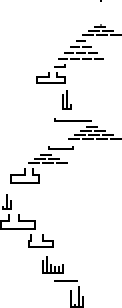

# Advent of Code 2022

My solutions to [Advent of Code 2022](https://adventofcode.com/2022) in C++. 

See each day here:

| Day | Problem Name | Problem Description | Code |
| --- | ------------ | ------------------- | ---- |
| 1 | Calorie Counting | [Link](https://adventofcode.com/2022/day/1) | [Link](src/dec01.cc) |
| 2 | Rock Paper Scissors | [Link](https://adventofcode.com/2022/day/2) | [Link](src/dec02.cc) |
| 3 | Rucksack Reorganization | [Link](https://adventofcode.com/2022/day/3) | [Link](src/dec03.cc) |
| 4 | Camp Cleanup | [Link](https://adventofcode.com/2022/day/4) | [Link](src/dec04.cc) |
| 5 | Supply Stacks | [Link](https://adventofcode.com/2022/day/5) | [Link](src/dec05.cc) |
| 6 | Tuning Trouble | [Link](https://adventofcode.com/2022/day/6) | [Link](src/dec06.cc) |
| 7 | No Space Left On Device | [Link](https://adventofcode.com/2022/day/7) | [Link](src/dec07.cc) |
| 8 | Treetop Tree House | [Link](https://adventofcode.com/2022/day/8) | [Link](src/dec08.cc) |
| 9 | Rope Bridge | [Link](https://adventofcode.com/2022/day/9) | [Link](src/dec09.cc) |
| 10 | Cathode-Ray Tube | [Link](https://adventofcode.com/2022/day/10) | [Link](src/dec10.cc) |
| 11 | Monkey in the Middle | [Link](https://adventofcode.com/2022/day/11) | [Link](src/dec11.cc) |
| 12 | Hill Climbing Algorithm | [Link](https://adventofcode.com/2022/day/12) | [Link](src/dec12.cc) |
| 13 | Distress Signal | [Link](https://adventofcode.com/2022/day/13) | [Link](src/dec13.cc) |
| 14 | Regolith Reservoir | [Link](https://adventofcode.com/2022/day/14) | [Link](src/dec14.cc) |
| 15 |  | [Link](https://adventofcode.com/2022/day/15) | [Link](src/dec15.cc) |
| 16 |  | [Link](https://adventofcode.com/2022/day/16) | [Link](src/dec16.cc) |
| 17 |  | [Link](https://adventofcode.com/2022/day/17) | [Link](src/dec17.cc) |
| 18 |  | [Link](https://adventofcode.com/2022/day/18) | [Link](src/dec18.cc) |
| 19 |  | [Link](https://adventofcode.com/2022/day/19) | [Link](src/dec19.cc) |
| 20 |  | [Link](https://adventofcode.com/2022/day/20) | [Link](src/dec20.cc) |
| 21 |  | [Link](https://adventofcode.com/2022/day/21) | [Link](src/dec21.cc) |
| 22 |  | [Link](https://adventofcode.com/2022/day/22) | [Link](src/dec22.cc) |
| 23 |  | [Link](https://adventofcode.com/2022/day/23) | [Link](src/dec23.cc) |
| 24 |  | [Link](https://adventofcode.com/2022/day/24) | [Link](src/dec24.cc) |
| 25 |  | [Link](https://adventofcode.com/2022/day/25) | [Link](src/dec25.cc) |

## Visualizations

### Day 9
__Part 1:__ The knot (green) swings behind the head of the rope (red). How many squares does the knot cover
(light green) as the head moves?

__Part 2:__ Now there are 9 knots. How many squares does the last one cover?

### Day 12
__Part 1:__ Finding the shortest path from blue to green (with requirement that you can only step up +1 height
at a time).

__Part 2:__ Find shortest path of all elevation 0 locations (with same requirements as above).

### Day 14
__Part 1:__ Count how many grains of sand fall until one drops into infinity.

__Part 2:__ Count how many grains of sand fall until source is plugged.

