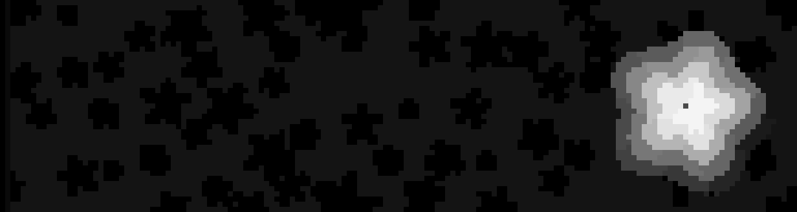
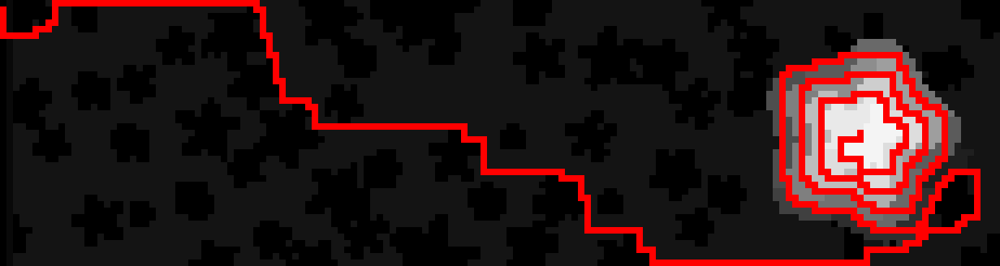

# Advent of Code C++

Years:
- **2022** [[Site](https://adventofcode.com/2022)] [[README](/2022/README.md)] [[Dir](/2022)]
- **2020** [[Site](https://adventofcode.com/2020)] [[README](/2020/README.md)][[Dir](/2020)]

## 2022

| Day | Problem Name | Problem Description | Code |
| --- | ------------ | ------------------- | ---- |
| 1 | Calorie Counting | [Link](https://adventofcode.com/2022/day/1) | [Link](2022/src/dec01.cc) |
| 2 | Rock Paper Scissors | [Link](https://adventofcode.com/2022/day/2) | [Link](2022/src/dec02.cc) |
| 3 | Rucksack Reorganization | [Link](https://adventofcode.com/2022/day/3) | [Link](2022/src/dec03.cc) |
| 4 | Camp Cleanup | [Link](https://adventofcode.com/2022/day/4) | [Link](2022/src/dec04.cc) |
| 5 | Supply Stacks | [Link](https://adventofcode.com/2022/day/5) | [Link](2022/src/dec05.cc) |
| 6 | Tuning Trouble | [Link](https://adventofcode.com/2022/day/6) | [Link](2022/src/dec06.cc) |
| 7 | No Space Left On Device | [Link](https://adventofcode.com/2022/day/7) | [Link](2022/src/dec07.cc) |
| 8 | Treetop Tree House | [Link](https://adventofcode.com/2022/day/8) | [Link](2022/src/dec08.cc) |
| 9 | Rope Bridge | [Link](https://adventofcode.com/2022/day/9) | [Link](2022/src/dec09.cc) |
| 10 | Cathode-Ray Tube | [Link](https://adventofcode.com/2022/day/10) | [Link](2022/src/dec10.cc) |
| 11 | Monkey in the Middle | [Link](https://adventofcode.com/2022/day/11) | [Link](2022/src/dec11.cc) |
| 12 | Hill Climbing Algorithm | [Link](https://adventofcode.com/2022/day/12) | [Link](2022/src/dec12.cc) |
| 13 | Distress Signal | [Link](https://adventofcode.com/2022/day/13) | [Link](2022/src/dec13.cc) |
| 14 | Regolith Reservoir | [Link](https://adventofcode.com/2022/day/14) | [Link](2022/src/dec14.cc) |
| 15 |  | [Link](https://adventofcode.com/2022/day/15) | [Link](2022/src/dec15.cc) |
| 16 |  | [Link](https://adventofcode.com/2022/day/16) | [Link](2022/src/dec16.cc) |
| 17 |  | [Link](https://adventofcode.com/2022/day/17) | [Link](2022/src/dec17.cc) |
| 18 |  | [Link](https://adventofcode.com/2022/day/18) | [Link](2022/src/dec18.cc) |
| 19 |  | [Link](https://adventofcode.com/2022/day/19) | [Link](2022/src/dec19.cc) |
| 20 |  | [Link](https://adventofcode.com/2022/day/20) | [Link](2022/src/dec20.cc) |
| 21 |  | [Link](https://adventofcode.com/2022/day/21) | [Link](2022/src/dec21.cc) |
| 22 |  | [Link](https://adventofcode.com/2022/day/22) | [Link](2022/src/dec22.cc) |
| 23 |  | [Link](https://adventofcode.com/2022/day/23) | [Link](2022/src/dec23.cc) |
| 24 |  | [Link](https://adventofcode.com/2022/day/24) | [Link](2022/src/dec24.cc) |
| 25 |  | [Link](https://adventofcode.com/2022/day/25) | [Link](2022/src/dec25.cc) |

## 2020

| Day | Problem Name | Problem Description | Code |
| --- | ------------ | ------------------- | ---- |
| 1 | Report Repair | [Link](https://adventofcode.com/2020/day/1) | [Link](2020/src/dec01_1.cc) [Link](2020/src/dec01_2.cc) |
| 2 | Password Philosophy | [Link](https://adventofcode.com/2020/day/2) | [Link](2020/src/dec02.cc) |
| 3 | Toboggan Trajectory | [Link](https://adventofcode.com/2020/day/3) | [Link](2020/src/dec03.cc) |
| 4 | Passport Processing | [Link](https://adventofcode.com/2020/day/4) | [Link](2020/src/dec04.cc) |
| 5 | Binary Boarding | [Link](https://adventofcode.com/2020/day/5) | [Link](2020/src/dec05.cc) |
| 6 | Custom Customs | [Link](https://adventofcode.com/2020/day/6) | [Link](2020/src/dec06.cc) |
| 7 | Handy Haversacks | [Link](https://adventofcode.com/2020/day/7) | [Link](2020/src/dec07.cc) |
| 8 | Handhelt Halting | [Link](https://adventofcode.com/2020/day/8) | [Link](2020/src/dec08.cc) |
| 9 | Encoding Error | [Link](https://adventofcode.com/2020/day/9) | [Link](2020/src/dec09.cc) |
| 10 | Adapter Array | [Link](https://adventofcode.com/2020/day/10) | [Link](2020/src/dec10.cc) |
| 11 | Seating System | [Link](https://adventofcode.com/2020/day/11) | [Link](2020/src/dec11.cc) |
| 12 | Rain Risk | [Link](https://adventofcode.com/2020/day/12) | [Link](2020/src/dec12.cc) |
| 13 | Shuttle Search | [Link](https://adventofcode.com/2020/day/13) | [Link](2020/src/dec13.cc) |
| 14 | Docking Data | [Link](https://adventofcode.com/2020/day/14) | [Link](2020/src/dec14.cc) |
| 15 | Rambunctious Recitation | [Link](https://adventofcode.com/2020/day/15) | [Link](2020/src/dec15.cc) |
| 16 | Ticket Translation | [Link](https://adventofcode.com/2020/day/16) | [Link](2020/src/dec16.cc) |
| 17 | Conway Cubes | [Link](https://adventofcode.com/2020/day/17) | [Link](2020/src/dec17.cc) |
| 18 | Operation Order | [Link](https://adventofcode.com/2020/day/18) | [Link](2020/src/dec18.cc) |
| 19 | Monster Messages | [Link](https://adventofcode.com/2020/day/19) | [Link](2020/src/dec19.cc) |
| 20 | Jurassic Jigsaw | [Link](https://adventofcode.com/2020/day/20) | [Link](2020/src/dec20.cc) |
| 21 | Allergen Assignment | [Link](https://adventofcode.com/2020/day/21) | [Link](2020/src/dec21.cc) |
| 22 | Crab Combat | [Link](https://adventofcode.com/2020/day/22) | [Link](2020/src/dec22.cc) |
| 23 | Crab Cups | [Link](https://adventofcode.com/2020/day/23) | [Link](2020/src/dec23.cc) |
| 24 | Lobby Layout | [Link](https://adventofcode.com/2020/day/24) | [Link](2020/src/dec24.cc) |
| 25 | Combo Breaker | [Link](https://adventofcode.com/2020/day/25) | [Link](2020/src/dec25.cc) |

# Visualizations

## 2022

### Day 12
__Part 1:__ Finding the shortest path from blue to green (with requirement that you can only step up +1 height
at a time).

__Part 2:__ Find shortest path of all elevation 0 locations (with same requirements as above).

### Day 14
__Part 1:__ Count how many grains of sand fall until one drops into infinity.

__Part 2:__ Count how many grains of sand fall until source is plugged.

